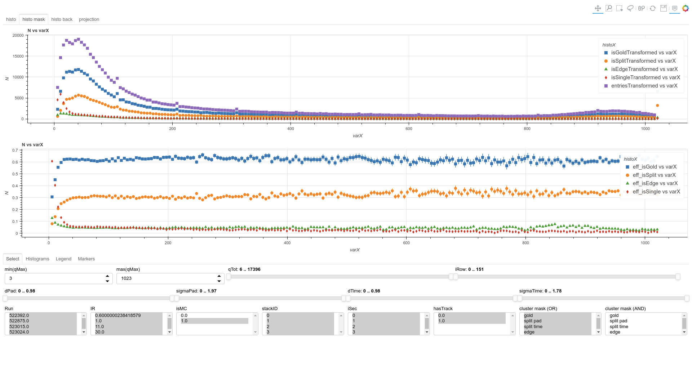

## README for bokeh widget array

The widget array declaration is used as an argument in bokehDrawSA to create an array of widgets interactivelly controlling figures/graphs/scatter plots/
Unbined or binned (histogram) bokeh data sources and derived variables and aggregated statistics.

The declarative programming used in bokehDrawSA is a type of coding where developers express the computational 
logic without having to programme the control flow of each process. This can help simplify coding, as developers 
only need to describe what they want the programme to achieve, rather than explicitly prescribing the steps or 
commands required to achieve the desired result.

```python
bokehDrawSA.fromArray(df, None, figureArray, widgetParams, layout=figureLayoutDesc, tooltips=tooltips, parameterArray=parameterArray,
                          widgetLayout=widgetLayoutDesc, sizing_mode="scale_width", nPointRender=300,
                           aliasArray=aliasArray, histogramArray=histoArray,arrayCompression=arrayCompression)`
```

For example usage see also Jupyter notebook tutorial file:
* https://github.com/miranov25/RootInteractive/blob/master/RootInteractive/tutorial/bokehDraw/standAlone.ipynb

##  Parameters of widget array

The layout of the widget array is as follows:

`[[widgetType,[variableName],{widgetOptions}], ...]`
* _widgetType_ - type of widget bokeh or composite.
* _variable_name_ - Name of the variable in the CDS or name of the parameter to be controlled
* _widgetOptions_ - dictionary of widget options needed for the bokeh widgets or derived RootInteractive widgets.

Bokeh standard widgets and RooInteractive composed widgets can be used to parameterzie dashboard behaviour. By default 
dictionary of options with name  as in standard bokeh used. Some extension, new variable to simplify the queries provided.
In the first version of the  RootInteractive some options could be specified as element of array, but that options is depreacated.

## Standard bokeh widget types supported
* _range_
* _slider_
* _spinner_
* _select_ 
* _multiSelect_
* _toggle_
* _text_

## RootInteractive special widgets
* _textQuery_
* _multiSelectBitmask_
  * selection using bitmask - e.g. for cut selection
  * _how_ option
    * "any" - using logical OR - at minimum one selected bit should be ON
    * "all" - using locgial AND - all selected bits has to be ON
    * see [cluster example](#Real-data-use-case---TPC-clusters-MC/data-comparison)
* _spinnerRange_
  * more flexible compared to standard bokeh range
  * possibility to specify <min,max> by text
  * spinner decrease/increase as exponential

### Widget special options
* _name_
  * can be specified for all widgets, used to identify widget in widget layout
*_toggleable_    
  * switch to enable/disable usage of the widget
* _type_ - for slider and range
  * "minmax" - using minimum mmaxim for column in dat souce as limit
  * "sigma": indication - n sima range used
    


### Example usage test_bokehDrawSA.py
* defining parameters of dashboard
  * https://github.com/miranov25/RootInteractive/blob/97885d5967b18c1a432e7fb49806d6f946b6df6a/RootInteractive/InteractiveDrawing/bokeh/test_bokehDrawSA.py#L52-L59
* Definition of widgets to control the selection of data sources and parameters. Some examples of custom widgets from RootInteractive: 
  * in the following example some widgets are linked together, their use can be toggled ON and OFF 
  * spinnerRange can be used to select a range with exponential delta step.
  * https://github.com/miranov25/RootInteractive/blob/97885d5967b18c1a432e7fb49806d6f946b6df6a/RootInteractive/InteractiveDrawing/bokeh/test_bokehDrawSA.py#L76-L96


### Example usage test_bokehClienHistogram.py
* defining parameter for visualization
  * number of  bins 
  * histogram ranges
  * https://github.com/miranov25/RootInteractive/blob/97885d5967b18c1a432e7fb49806d6f946b6df6a/RootInteractive/InteractiveDrawing/bokeh/test_bokehClientHistogram.py#L32-L36

* defining widgets for data source selection and parameter control
  * https://github.com/miranov25/RootInteractive/blob/97885d5967b18c1a432e7fb49806d6f946b6df6a/RootInteractive/InteractiveDrawing/bokeh/test_bokehClientHistogram.py#L38-L49
* use histogram parameters `nBins`,`histoRangeA` in histograms
  * https://github.com/miranov25/RootInteractive/blob/97885d5967b18c1a432e7fb49806d6f946b6df6a/RootInteractive/InteractiveDrawing/bokeh/test_bokehClientHistogram.py#L57-L62
### Real data use case - TPC clusters MC/data comparison

* https://gitlab.cern.ch/alice-tpc-offline/alice-tpc-notes/-/blob/7ab10e422686f2641b1a3fb92bb5db78a10fd3fb/JIRA/ATO-609/clusterDumpDraw.ipynb
* https://indico.cern.ch/event/1126852/contributions/5024254/attachments/2499244/4293937/tpcClusters.html

* defining parameter array
  * `varX` - variable (column|alias) to histogram 
  * `nbinsX`, `nbinsY` - dynamic binning on client
  * `qScaleMC`     - user defined scaling used further in alias as multiplicative function
```python
 parameterArray = [  
    {"name": "varX", "value":"qMax", "options":["qMax","qTot","qMaxS","sigmaPad","sigmaTime","mask","dTime","dPad","IR","iRow","stackID","iSec"]},
    {"name": "nbinsX", "value":30, "range":[10, 500]},
    {"name": "nbinsY", "value":30, "range":[10, 100]},
    {"name": "qScaleMC", "value":1, "range":[0.5, 2]},
    {"name": "yAxisTransform", "value":"linear", "options":["linear","sqrt","log"]},
]
```
* making widgets
  * _spinnerRange_ for the qMax used to be able to select <min,max> by text or spinner without complication of binning 
```python
widgetParams=[
              #['spinnerRange', ['qMax'], {}],
              ['spinnerRange', ['qMax'],{"name": "qMax"}],
              #['range', ['qMax'],{"name": "qMax"}],
              ['range', ['qTot'],{"name": "qTot"}],
#              ['range', ['weight'],{"name": "weight"}],
              ['range', ['iRow'],{"name": "iRow"}],
              #
              ['range', ['dPad'],{"name": "dPad"}],
              ['range', ['sigmaPad'],{"name": "sigmaPad"}],
              ['range', ['dTime'],{"name": "dTime"}],
              ['range', ['sigmaTime'],{"name": "sigmaTime"}],
              #
              ['multiSelect',["Run"],{"name":"Run"}],
              ['multiSelect',["IR"],{"name":"IR"}],
              ['multiSelect',["isMC"],{"name":"isMC"}],
              ['multiSelect',["iSec"],{"name":"iSec"}],
              ['multiSelect',["stackID"],{"name":"stackID"}],
              ['multiSelect',["hasTrack"],{"name":"hasTrack"}],
              ['multiSelectBitmask', ['clMask'], {"mapping": {"gold":0x10,"split pad":1,"split time":2,"edge":4,"single":8}, "how":"any", "name": "clusterMaskAny", "title": "cluster mask (OR)"}],
              ['multiSelectBitmask', ['clMask'], {"mapping": {"gold":0x10,"split pad":1,"split time":2,"edge":4,"single":8}, "how":"all", "name": "clusterMaskAll", "title": "cluster mask (AND)"}],
              #
              ['select', ['varX'], {"name": "varX"}],
              ['spinner', ['nbinsY'], {"name": "nbinsY"}],
              ['spinner', ['nbinsX'], {"name": "nbinsX"}],
              ['slider', ['qScaleMC'], {"name": "qScaleMC"}],
              ['select', ['yAxisTransform'], {"name": "yAxisTransform"}],
]
```
* example view
